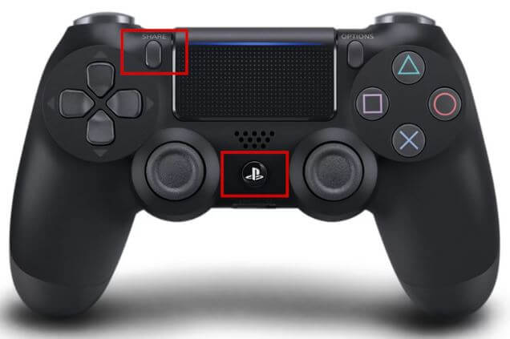

# ESP32 Controller 🎮
This is a project that uses a PS4 controller combined with a FREENOVE ESP32-WROOM and breakout board. It allows the user to use a PS4 controller to control outputs on the FREENOVE breakout board. Other controllers can be used, button assignments may need to be changed. When flashing the board select '_ESP32-WROOM-DA Module_' from the list of available boards manager. 

Once flashed the PS4 controller can be paired by pressing and holding the playstation logo and share button simultaneously. 

Features:
- Users can trim the joystick position using R1 and L1 combined with the D-pad to trim the left and right joystick. This is implemented in the `GamepadController.cpp`. The remote should vibrate to indicate the trim is being adjusted.

        L1 + D-pad Left will trim the left joystick left

- Users can upload a .wav audio file to the SD card. The file name called in the example can be changed in the `Audioplayer.cpp`. The current example will loop the current audio file selected when you press X on the PS4 controller. 

# Hardware
- [FREENOVE ESP32](https://vi.aliexpress.com/item/1005005776600877.html)

- [FREENOVE ESP32 Breakout](https://vi.aliexpress.com/item/1005005879655901.html)

- [Micro SD Card Reader](https://lonelybinary.com/products/micro-sd-reader-module-pack-of-3)

- [MAX98357 I2S DAC Decoder with 3W Amplifier](https://lonelybinary.com/products/max98357)

- [4 Ohm Speaker](https://vi.aliexpress.com/item/1005005699882165.html)

# Software
## Required Arduino ESP32 Board Libraries
 - [bluepad32 - V4.1.0](https://github.com/ricardoquesada/bluepad32)

## Required Arduino Libraries
 - [ESP32-audioI2S - V3.0.12](https://github.com/schreibfaul1/ESP32-audioI2S)
